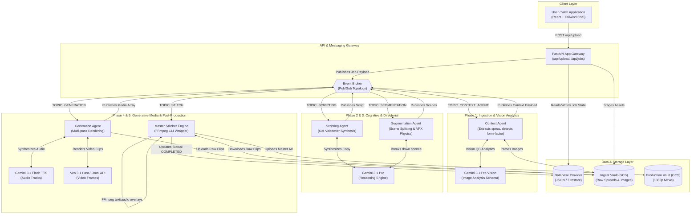
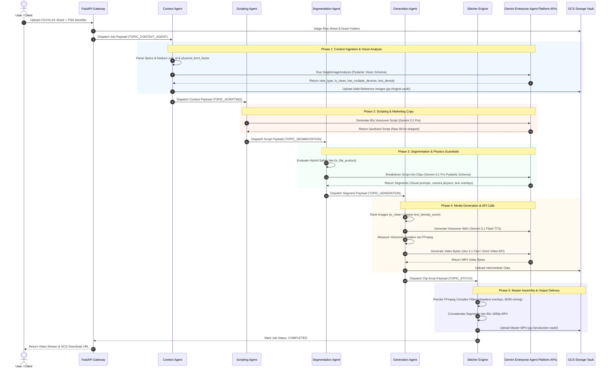
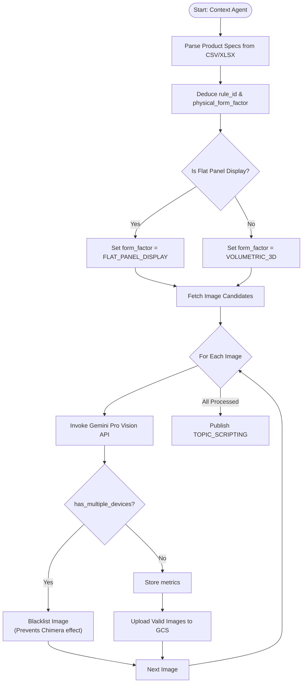
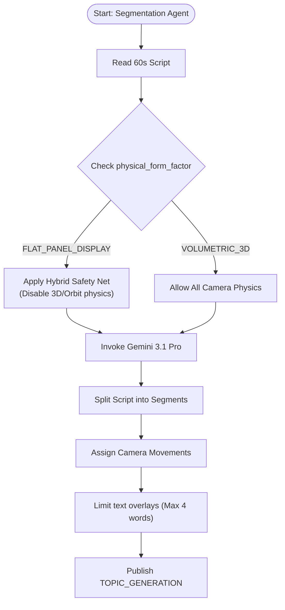
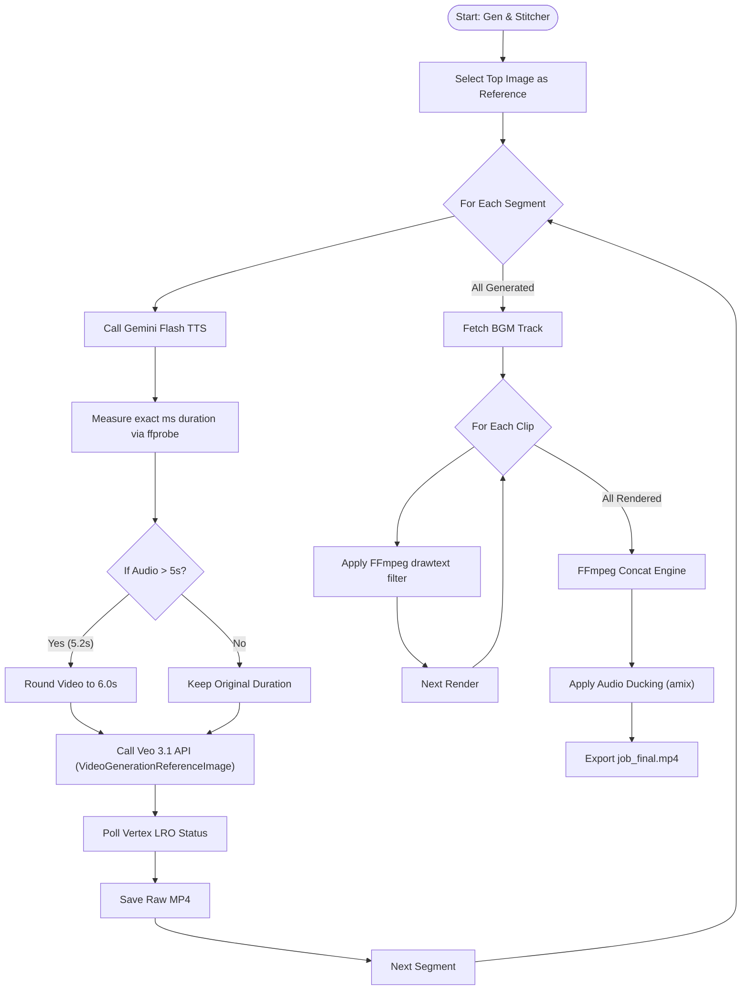

# 🏗️ ZiWan - Ad Studio - The Complete Technical & Architecture Dossier

**Enterprise-Grade Automated Video Ad Generation Pipeline**

This document serves as the exhaustive engineering masterclass for the ZiWan - Ad Studio. It outlines the system-level components, micro-agent reasoning logic, exact API data schemas, compositing commands, and the deployment topology used to transform raw e-commerce product catalogs into broadcast-ready, 60-second video advertisements.

---

## 1. High-Level System Architecture

The system leverages an asynchronous, event-driven microservices architecture via Google Cloud Pub/Sub to prevent blocking during long video rendering tasks.



### Component Breakdown & Architectural Rationale
*   **FastAPI Gateway:** Chosen for high concurrency support when accepting massive catalog uploads.
*   **Event Broker (Pub/Sub):** Video generation is notoriously slow. Synchronous HTTP would time out. Pub/Sub allows agents to pick up jobs asynchronously and retry on failures.
*   **Gemini Enterprise Agent Platform Foundation Models:** Uses Gemini 3.1 Pro for complex reasoning, Vision for Image QC, Flash TTS for ultra-fast audio, and Veo 3.1 for state-of-the-art multimodal video generation.
*   **Stitcher Engine (FFmpeg):** Uses system-level FFmpeg for blazingly fast compositing, avoiding heavy and costly cloud-rendering services.

---

## 2. End-to-End Execution Sequence Flow



---

## 3. Exhaustive Micro-Agent Workflows & Data Schemas

### Phase 1: Context & Vision Agent Workflow
Data ingestion and strict visual quality assurance to prevent AI hallucination.



**Implementation Details & Schemas:**
To ensure precise evaluation, the Vision model is constrained by a strict Pydantic JSON schema:
```python
class SingleImageAnalysis(BaseModel):
    view_type: Literal["FRONT", "BACK", "SIDE_PORTS", "OPEN_SCREEN_AND_DECK", "TOP_PANEL", "OTHER"]
    is_clean_product_shot: bool
    has_multiple_devices: bool # If True, immediately blacklisted
    text_density_score: int    # 0 to 100
    color_family: str
    primary_material_guess: str
```

### Phase 3: Segmentation Agent Workflow
Acts as the "Director", planning the shot list and implementing physical camera constraints.



**Implementation Details & Schemas:**
The **Hybrid Safety Net** forces constraints. If `is_flat_product` is true, the prompt explicitly blocks orbital movements that cause 2D objects to "melt" in diffusion models.
```python
class VideoSegment(BaseModel):
    segment_number: int
    duration_seconds: Literal[4, 6, 8]
    voiceover_text: str
    visual_prompt: str
    camera_movement: str
    text_overlay_highlight: str # Guaranteed <= 4 words
```

### Phase 4 & 5: Media Generation & Stitching Pipeline
Handles exact audio-visual alignment and final rendering.



**Implementation Details & Commands:**
*   **Exact Audio Duration Logic:** Generates TTS audio *first*, preventing videos from clipping spoken words prematurely.
*   **Compositing Command (FFmpeg):** Draws custom typography directly over the video using native filters.
    ```bash
    ffmpeg -i clip_1_raw.mp4 -vf "drawtext=fontfile=Outfit-Bold.ttf:text='120Hz OLED Display':fontcolor=white:fontsize=48:x=(w-text_w)/2:y=h-120:box=1:boxcolor=black@0.6" -c:a copy clip_1_text.mp4
    ```

---

## 4. Environment & Deployment Configuration

### Critical Environment Variables
| Variable | Description |
| :--- | :--- |
| `GOOGLE_CLOUD_PROJECT` | GCP Project ID (e.g., `your-gcp-project-id`) |
| `DEFAULT_LOCATION` | Region for Gemini Enterprise Agent Platform (e.g., `us-central1`) |
| `INGEST_BUCKET` | Vault for raw catalog sheets and images |
| `OUTPUT_BUCKET` | Vault for finalized video ads |
| `DEFAULT_MODEL` | Set to `gemini-3.1-pro-preview` |
| `DEFAULT_VIDEO_MODEL` | Set to `gemini-omni-flash-preview` / `veo-3.1-fast` |

### Containerization (Docker)
Built on a lightweight Python image with system FFmpeg installed for rapid compositing.
```dockerfile
FROM python:3.12-slim
RUN apt-get update && apt-get install -y ffmpeg curl && rm -rf /var/lib/apt/lists/*
WORKDIR /app
COPY requirements.txt .
RUN pip install --no-cache-dir -r requirements.txt
COPY . .
EXPOSE 8080
CMD ["uvicorn", "backend.main:app", "--host", "0.0.0.0", "--port", "8080"]
```

### Cloud Run Deployment
A single command deploys the entire asynchronous suite:
```bash
gcloud run deploy ad-creator-studio \
  --source . \
  --region us-central1 \
  --allow-unauthenticated \
  --set-env-vars GOOGLE_CLOUD_PROJECT=your-gcp-project-id
```

---

## 5. Sample Dataset Reference

To help you get started immediately, we have included a `sample_dataset/` directory in this repository. It serves as a "North Star" example for data formatting.

The dataset includes:
- **15 Distinct Products:** Ranging from flat panel displays (smartphones, TVs) to volumetric appliances (motorcycles, blenders) to fully test the Hybrid Safety Net.
- **45 Clean Studio Images:** Exactly 3 angles per product (e.g., Front, Side, Back) on pure white backgrounds, ensuring the `is_clean_product_shot` flag returns `True`.
- **`sample_catalog.csv`:** A properly formatted catalog mapping the products to their `Image Path 1`, `Image Path 2`, and `Image Path 3`.


---

## ⚠️ Prototype Disclaimer & Production Readiness

**ZiWan - Ad Studio** is provided as an open-source architectural blueprint and Proof-of-Concept (PoC). While the underlying Gemini Enterprise Agent Platform (including **Gemini Omni Flash and Veo**) offers enterprise-grade capabilities, the orchestration layer in this repository has been designed for demonstration and foundational prototyping purposes. 

**Important considerations before production deployment:**
This solution should **not** be deployed into a production environment without undergoing rigorous, enterprise-standard validations. If adapting this architecture for a live project, organizations must implement and validate proper Non-Functional Requirements (NFRs) and functional test suites, including but not limited to:
* **Functional & Integration Testing:** Ensuring end-to-end multi-agent workflows gracefully handle data anomalies, API timeouts, and edge cases.
* **Comprehensive Load Testing:** Validating system stability and throughput under massive, concurrent asynchronous job volumes.
* **Quota & Throttling Management:** Implementing strict API rate-limiting, robust Dead Letter Queues (DLQs), and enforcing quota limits to prevent runaway billing or throttling errors.
* **Security & Auditing:** Conducting thorough security reviews prior to handling live customer data. 

This repository is strictly for educational, prototyping, and foundational architectural design.
