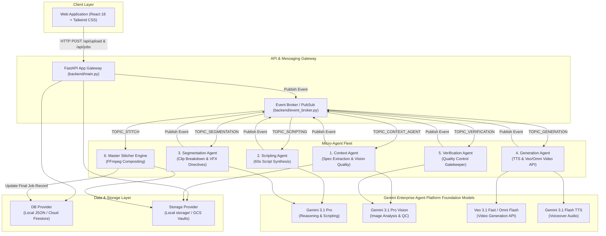
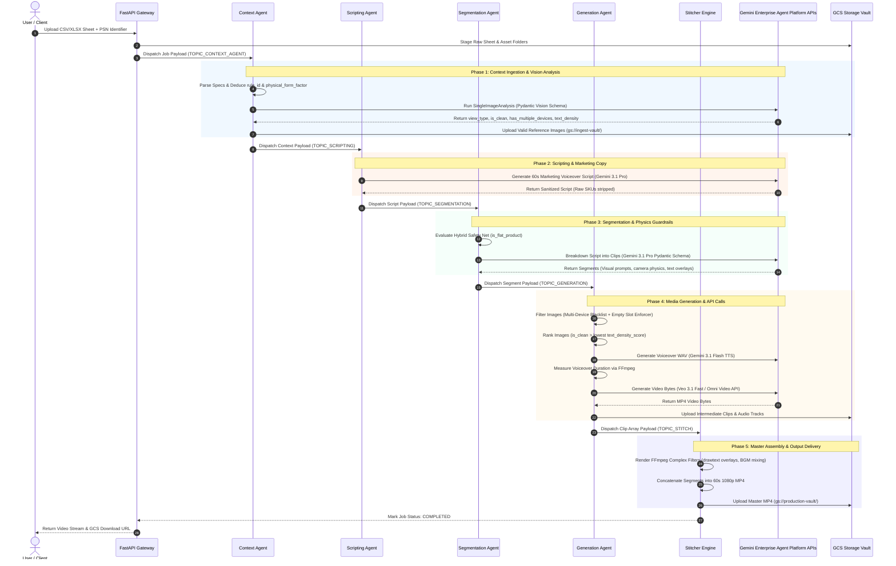

# 📑 Technical Architecture Dossier: ZiWan - Ad Studio
**Enterprise-Grade Automated Video Ad Generation Pipeline**

---

## 1. Executive Summary & Core Objectives

**ZiWan - Ad Studio** is an autonomous multi-agent video production pipeline engineered to transform raw e-commerce product catalogs (Excel/CSV specifications and uncurated product images) into broadcast-ready, 60-second video advertisements.

### Key Capabilities
* **Multi-Agent Orchestration:** Specialized Python micro-agents collaborating asynchronously via event-driven messaging (Google Cloud Pub/Sub architecture).
* **Foundation Models:** Powered by Gemini Enterprise Agent Platform foundation models (**Gemini 3.1 Pro**, **Gemini Omni Flash**, **Veo 3.1 Fast**, **Gemini 3.1 Flash TTS**, and **Lyria Audio**).
* **Computer Vision Guardrails:** Automated image filtering using structured vision Pydantic analysis to eliminate multi-device clutter, infographic text bleeding, and 3D chassis distortion ("melting").
* **Procedural Compositing Engine:** Multi-pass FFmpeg rendering pipeline performing automated text overlay drawing, audio crossfading, voiceover time-stretching, and 1080p master assembly.

---

## 2. High-Level System Architecture



---

## 3. End-to-End Execution Sequence Flow



---

## 4. Deep-Dive Micro-Agent Architecture

### Step 1: Ingestion & API Gateway (`backend/main.py` & `batch_ingestion_agent.py`)

* **Primary Function:** Ingests product catalog spreadsheets (`.csv`, `.xlsx`) and image ZIP archives, initializes the job state machine, and triggers asynchronous processing.
* **Libraries & Tools:** `FastAPI`, `uvicorn`, `pandas`, `openpyxl`, `zipfile`, `google-cloud-storage`.
* **Key Tasks:**
  1. Validates payload headers, category parameters, and target product SKUs (PSN/FSN).
  2. Stages raw files to the Ingest GCS Vault (`${PROJECT_ID}-ingest-vault`).
  3. Creates an initial job record in the database provider with status `"QUEUED"`.
  4. Publishes a job payload to `TOPIC_CONTEXT_AGENT` via `EventBroker`.

---

### Step 2: Context Agent (`backend/agents/context_agent.py`)

* **Primary Function:** Extracts technical product specifications and performs Computer Vision feature analysis on catalog images.
* **APIs & Models:** **Gemini 3.1 Pro Vision** (`gemini-3.1-pro-preview`), `google-genai` SDK, `pydantic`.
* **Key Mechanisms:**
  1. **Spec Parser:** Extracts key-value specifications and feature implications from Excel/CSV sheets.
  2. **AI Decoupled Rule Deduction:** Evaluates product attributes to deduce the category `rule_id` (e.g. `laptops`, `tv`, `headphones`, `motorcycles`, `ac`).
  3. **Dynamic Physical Form-Factor Auto-Detection:** Classifies the product form factor:
     ```python
     is_flat_form_factor = any(k in specs_string or k in category_tab.lower() or k in rule_id for k in ['mobile', 'phone', 'tv', 'television', 'monitor', 'display', 'screen', 'tablet', 'kiosk', 'digital_frame'])
     product_metadata['physical_form_factor'] = 'FLAT_PANEL_DISPLAY' if is_flat_form_factor else 'VOLUMETRIC_3D'
     ```
  4. **Vision Feature Classification:** Invokes Gemini Vision with a Pydantic schema (`SingleImageAnalysis`) to extract:
     * `view_type`: (`FRONT`, `BACK`, `SIDE_PORTS`, `OPEN_SCREEN_AND_DECK`, `TOP_PANEL`, `OTHER`)
     * `is_clean_product_shot`: `True` if clean studio shot on neutral background without infographic text.
     * `has_multiple_devices`: `True` if more than 1 instance of the product is in the frame. (Dynamic prompt injection: `f"CRITICAL: If the image shows more than one {rule_id.replace('_', ' ')}..."`).
     * `text_density_score`: Coverage score from 0 to 100 representing infographic banner clutter.
  5. **GCS Storage Sync:** Uploads valid catalog images to `gs://${PROJECT_ID}-ingest-vault/reference_images/{psn}/`.

---

### Step 3: Scripting Agent (`backend/agents/scripting_agent.py`)

* **Primary Function:** Synthesizes a cohesive 60-second marketing voiceover script tailored to target product specifications.
* **APIs & Models:** **Gemini 3.1 Pro** (`gemini-3.1-pro-preview`), `CategoryDatabaseProvider`.
* **Key Rules & Directives:**
  * **Brand Fidelity:** Integrates brand name, model name, and spec implications naturally.
  * **Raw SKU Removal:** Strips unpronounceable catalog primary keys (e.g., `"ACNHGCG5KXYME36M"`).
  * **Sentence Integrity:** Ensures voiceover sentences end with clean punctuation to facilitate clip splitting.

---

### Step 4: Segmentation Agent (`backend/agents/segmentation_agent.py`)

* **Primary Function:** Breaks the 60-second voiceover script into sequential visual segments (4s, 6s, or 8s clips) and attaches dynamic camera movement and VFX directives.
* **APIs & Models:** **Gemini 3.1 Pro** (`gemini-3.1-pro-preview`), `pydantic` (`SegmentationResponse`, `VideoSegment`).
* **Critical Guardrails Implemented:**
  1. **Hybrid Safety Net (`is_flat_product`):**
     ```python
     is_known_flat = any(x in category_tab for x in ['mobile', 'phone', 'tv', 'television']) or any(x in rule_id for x in ['mobile', 'phone', 'tv', 'television'])
     is_ai_detected_flat = (metadata.get('physical_form_factor') == 'FLAT_PANEL_DISPLAY')
     is_flat_product = is_known_flat or is_ai_detected_flat
     ```
     If `is_flat_product == True`, restricts camera physics to `["Slow linear push-in", "Static premium hero shot"]` and bans 360°/180°/90° orbits to prevent 2D display chassis melting.
  2. **Anti-Chimera Surface Isolation:** Enforces 1 product surface per clip (prohibits mixing front screens and rear camera setups in the same prompt).
  3. **Banned Camera Jargon Directive:** Prohibits technical cinematography terms (`35mm`, `ARRI`, `f/1.4`, `viewfinder`) to prevent diffusion models from rendering camera UI overlays.
  4. **Text Overlay Constraint:** Limits highlights to a maximum of 4 words per scene (with a multiline summary exception for the finale clip).

---

### Step 5: Generation Agent (`backend/agents/generation_agent.py`)

* **Primary Function:** Performs multi-pass image selection, TTS voiceover generation, media duration measurement, and Gemini Enterprise Agent Platform video generation.
* **APIs & Models:** **Veo 3.1 Fast** (`veo-3.1-fast-generate-001`) / **Gemini Omni Flash** (`gemini-omni-flash-preview`), **Gemini 3.1 Flash TTS** (`gemini-3.1-flash-tts-preview`), `imageio_ffmpeg`.
* **Image Selection Algorithm:**
  1. **Multi-Device Filter:** Rejects images with `has_multiple_devices == True`.
  2. **Empty Slot Enforcer:** For flat products, rejects `OTHER` views unless `is_clean == True`.
  3. **Two-Tier Sort:** Ranks remaining candidates:
     ```python
     images.sort(key=lambda x: (x["is_clean"], -x["text_density"]), reverse=True)
     ```
     *Priority 1:* Clean Studio Shots (`is_clean == True`).
     *Priority 2:* Lowest `text_density_score`.
  4. **TTS Audio Synthesis & Measurement:** Generates voiceover `.wav` audio via Gemini TTS and queries exact duration using system FFmpeg (`get_media_duration`).
  5. **Gemini Enterprise Agent Platform Video API Call:** Constructs `types.GenerateVideosConfig` with target duration, 16:9 aspect ratio, `DONT_ALLOW` person generation, and attached `types.VideoGenerationReferenceImage` objects. Polls asynchronous LRO operation until complete.

---

### Step 6: Verification Agent (`backend/agents/verification_agent.py`)

* **Primary Function:** Acts as an automated Quality Control gatekeeper.
* **APIs & Models:** **Gemini 3.1 Pro Vision** (`gemini-3.1-pro-preview`), `opencv-python` / `FFmpeg`.
* **Key Tasks:**
  * Extracts representative video frames from generated MP4 bytes.
  * Inspects video clips for severe visual artifacts, logo corruption, or prompt mismatch.
  * Approves clips for master stitching or flags failed segments.

---

### Step 7: Master Stitcher Engine (`backend/stitching/stitcher.py`)

* **Primary Function:** Executes final master video compositing, audio mixing, text rendering, and GCS output vault delivery.
* **Libraries & Tools:** System `FFmpeg` binary (`libfreetype`, `drawtext`, `filter_complex`), `PIL` (Pillow), `google-cloud-storage`.
* **Compositing Pipeline:**
  1. **Audio Alignment:** Blends TTS voiceover track with background music (BGM) generated via Lyria/fallback audio engine, applying ducking filters.
  2. **Typography Rendering:** Draws product titles and feature highlights using custom TTF fonts (`Outfit-Bold.ttf`) via FFmpeg `drawtext` filters:
     ```bash
     ffmpeg -i input.mp4 -vf "drawtext=fontfile=Outfit-Bold.ttf:text='15.6-inch FHD Display':fontcolor=white:fontsize=48:x=(w-text_w)/2:y=h-120:box=1:boxcolor=black@0.6" -c:a copy output.mp4
     ```
  3. **Concat Engine:** Concatenates all composited video segments into a master 60-second 1080p MP4 file.
  4. **Vault Delivery:** Uploads master MP4 to Production Vault (`gs://${PROJECT_ID}-production-vault/`).

---

## 5. Database & Storage Architecture

### **1. Hybrid Database Layer (`backend/db_provider.py`)**
* **Local Mode:** Lightweight, thread-safe JSON document store (`database/jobs.json`) initialized automatically on first run.
* **Production GCP Mode:** Auto-detects `RUNNING_ON_GCP` and switches transparently to **Google Cloud Firestore** (`jobs` collection).

### **2. Hybrid Storage Layer (`backend/storage_provider.py`)**
* **Local Mode:** Persists clips, temp files, and generated outputs to local directory structure (`storage/temp_clips/`, `storage/final/`).
* **Production GCP Mode:** Uploads objects directly to Google Cloud Storage buckets:
  * Ingest Bucket: `${GOOGLE_CLOUD_PROJECT}-ingest-vault`
  * Production Bucket: `${GOOGLE_CLOUD_PROJECT}-production-vault`

---

## 6. Environment Configuration Reference

The application is fully parameterized via environment variables (`.env` file or GCP Cloud Run configuration):

| Environment Variable | Description | Default Fallback |
| :--- | :--- | :--- |
| `GOOGLE_CLOUD_PROJECT` | GCP Project ID for Gemini Enterprise Agent Platform and GCS API calls. | `dark-torch-384306` |
| `DEFAULT_LOCATION` | Regional location for standard Gemini Enterprise Agent Platform models. | `asia-south1` |
| `GCS_MOUNT_PATH` | Path for temporary file staging. | `/tmp/` |
| `INGEST_BUCKET` | GCS bucket name for raw catalog sheets and images. | `${PROJECT_ID}-ingest-vault` |
| `OUTPUT_BUCKET` | GCS bucket name for finalized video ads. | `${PROJECT_ID}-production-vault` |
| `DEFAULT_MODEL` | Foundation model for context, scripting, and segmentation. | `gemini-3.1-pro-preview` |
| `DEFAULT_VIDEO_MODEL` | Video generation engine model endpoint. | `gemini-omni-flash-preview` |
| `DEFAULT_TTS_MODEL` | Text-To-Speech voiceover model endpoint. | `gemini-3.1-flash-tts-preview` |
| `PRODUCT_ALIASES` | JSON string mapping PSN catalog anomalies to image folder names. | `{"ACCG7YFMFQQTM93Z": "ACCGJYHMFUKZ2V5N", ...}` |

---

## 7. Containerization & Deployment Topology

### **Dockerfile Specification**
The system is packaged into a lightweight Linux container (`python:3.12-slim`) with system `ffmpeg` pre-installed:

```dockerfile
FROM python:3.12-slim
RUN apt-get update && apt-get install -y ffmpeg curl && rm -rf /var/lib/apt/lists/*
WORKDIR /app
COPY requirements.txt .
RUN pip install --no-cache-dir -r requirements.txt
COPY . .
EXPOSE 8080
CMD ["uvicorn", "backend.main:app", "--host", "0.0.0.0", "--port", "8080"]
```

### **Infrastructure as Code (Terraform)**
The repository includes a complete, production-ready **Terraform (HCL)** deployment module under `terraform/`:
* **Cloud Run v2 Service:** Configured with 2 vCPU, 4 GB RAM, scale-to-zero autoscaling, and 3600s execution timeout.
* **GCS Storage Vaults:** Assets, Outputs, and Auto-purging Staging vaults with 7-day lifecycle retention rules.
* **Pub/Sub Messaging:** Event-driven micro-agent topics + Dead-Letter Queue (DLQ) safeguards.
* **Artifact Registry:** Dedicated Docker container repository (`ziwan-ad-studio-repo`).

```bash
cd terraform
terraform init && terraform apply
```

### **Automated CI/CD Pipeline (GitHub Actions)**
The repository contains a GitHub Actions workflow (`.github/workflows/ci_cd_deploy.yml`) that automatically:
1. Runs Python `flake8` linting and unit tests on pull requests.
2. Validates Terraform syntax and formatting (`terraform validate`).
3. Builds the Docker container, pushes to GCP Artifact Registry, and deploys to Cloud Run on merge to `main`.


---

## ⚠️ Prototype Disclaimer & Production Readiness

**ZiWan - Ad Studio** is provided as an open-source architectural blueprint and Proof-of-Concept (PoC). While the underlying Gemini Enterprise Agent Platform (including **Gemini Omni Flash and Veo**) offers enterprise-grade capabilities, the orchestration layer in this repository has been designed for demonstration and foundational prototyping purposes. 

**Important considerations before production deployment:**
This solution should **not** be deployed into a production environment without undergoing rigorous, enterprise-standard validations. If adapting this architecture for a live project, organizations must implement and validate proper Non-Functional Requirements (NFRs) and functional test suites, including but not limited to:
* **Functional & Integration Testing:** Ensuring end-to-end multi-agent workflows gracefully handle data anomalies, API timeouts, and edge cases.
* **Comprehensive Load Testing:** Validating system stability and throughput under massive, concurrent asynchronous job volumes.
* **Quota & Throttling Management:** Implementing strict API rate-limiting, robust Dead Letter Queues (DLQs), and enforcing quota limits to prevent runaway billing or throttling errors.
* **Security & Auditing:** Conducting thorough security reviews prior to handling live customer data. 

This repository is strictly for educational, prototyping, and foundational architectural design.
